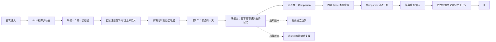

# Memory Home / 记忆家园
产品需求文档 v2.1（完整交互架构整合版）

> 本版基于 `puppyisland_PRD_v2.0.md`、`宠物记忆AI产品完整交互架构.rtf` 及已确认的 grill-me 决策整合。v2.0 保留不改；本版用于后续逻辑评审和原型迭代。

## 1. 已确认决策

- 产品闭环：看见 TA → 找回记忆 → 继续陪伴。
- 三个 MVP 场景结束后直接进入唯一的 Companion，不设置 Companion Lite。有效 Memory 不足时使用低细节 Base 形象和中性叙事，不引用具体过去事实。
- 当前 MVP 暂不提供可见记忆卡；记忆卡、记忆抽屉和显式卡片确认列为后续版本能力。
- 宠物名称由用户主动填写；视觉采用统一治愈系 2D 插画风。
- Guest Session 可完整体验，登录只用于长期保存和跨设备恢复。
- 不设置 Memory Growing；三个 MVP 场景结束后直接进入聊天。
- Companion 首次自动开场，可跳过；当前 MVP 只保留聊天场景，不提供记忆抽屉、记忆卡或回看入口。
- 当前 MVP 暂不提供聊天中新记忆的可见卡片确认；新记忆识别和显式管理列为后续版本。
- 语音支持录音、Mock ASR、发送前编辑；失败退化为文字。
- 家园场景回答先作为记忆保存，不自动切换背景。
- 用户表达强烈痛苦时，温和陪伴并提示联系信任的人或专业支持。
- 当前三张参考图不作为后续设计依据；视觉和动画资产以用户后续提供的设计图/指定动画为准。
- 不在开场或主流程明确说明“离开”；相关情绪仅以光影、脚步、留白、声音与场景氛围隐喻。
- 取消独立宠物重建页：第一段场景以自然旁白和发光爪印邀请用户说出 TA 的名字，并提供可选照片入口；宠物从模糊轮廓开始，由照片和口述逐步形成。
- 形象生成采用统一的 Base 设计底图/角色模板；根据用户描述、可选照片和后续纠正生成同一风格的宠物形象。信息不足时以柔和、低细节或未完全定型状态呈现，不阻塞 Companion。
- 第二阶段每个场景结束后立即后台提取、整理和结构化 Memory，不打断场景；第三阶段将符合规则的 Memory 隐形注入聊天上下文，重点验证角色代入感与记忆一致性。可见记忆卡和显式确认暂不实现。
- 模型推断、模糊内容和敏感内容不作为具体事实引用；Memory 不足时不阻塞进入 Companion，使用低细节 Base 形象和中性叙事。
- 每个场景结束后立即后台整理 Memory；后续场景读取已整理内容并动态调整，第三阶段直接读取累积的有效 Memory。
- 不存在 Lite 升级流程；全程只有一个 Companion 模式。
- `StoryState` 持久化：用户再次进入 Companion 时，从上次事件自然续写。StoryState 仅保存想象性剧情的场景、事件线索、角色动作/位置与未完互动，不写回真实 Memory。
- MVP 不提供主动“换个场景”或多故事线入口；用户始终续写当前唯一活跃的 StoryState。当一个事件自然收束后，系统在同一世界连续性中自行推进下一段日常情节。
- 用户尚未提供宠物名称时，Companion 仍可使用第一人称“我”进行对白，但不称呼具体名字；名称补充后再自然更新称呼。
- Base 设计底图准备 5 种 MVP 基础姿态：`idle`、`靠近`、`开心`、`奔跑`、`低落`。用户输入只改变外观参数、动作节奏和状态触发，不改变画风与角色结构；信息不足时至少使用 `idle`。
- Companion 使用固定 Base 家园背景；前三个场景和聊天中的安全 Memory 只影响角色设定、叙事资产和少量安全元素替换，不改变整体背景布局。
- Companion 输入框右侧提供“继续”播放图标；用户不知道说什么时点击，系统直接生成下一轮环境描述、角色动作、对白和事件推进。
- Companion MVP 仅支持文字聊天；语音只用于前序场景采集与转写。
- 场景一跳过名称或照片后，MVP 不提供后续主动补充入口，继续使用低细节 Base 形象。
- Guest Session 在当前设备永久保存，直到用户主动清除；不因离开页面自动失效。
- MVP 完全不使用敏感 Memory：不设计授权入口，也不将敏感内容传入 CharacterProfile、NarrativeAssets 或聊天 grounding。即使用户主动提及，系统仅提供温和、非细节化回应；敏感能力延期到后续版本。

## 2. 架构整合原则

### 2.1 前台交互原则

前台不展示“访谈问卷”“问题列表”“资料完成百分比”，也不把 AI 做成一个等待回答的聊天头像。用户跟随爪印进入场景，通过触碰物件、按住发光爪印说话，看到世界立即因记忆发生变化。

### 2.2 后台信息地图

此前确认的 5 个核心问题保留为后台采集目标，不直接以问题卡呈现；三个 MVP 场景结束后不设固定记忆数量门槛，直接进入 Companion：

1. TA 的辨识特征；
2. TA 普通的一天；
3. 最能代表关系的故事；
4. 最怕失去的记忆；
5. 希望家园出现的场景。

题目文案仍为暂定配置，可替换而不改变前台场景结构。系统根据自然口述覆盖目标，不要求按字段逐项回答。

### 2.3 脚步与爪印

脚步不是积分或任务完成度，而是 TA 曾经走过的痕迹。它承担导航、记忆留痕、时空连接和生命痕迹四个作用。脚步速度、大小、节奏可由年龄、体型、性格和场景决定；后台 Memory 纳入上下文后，对应爪印变为温暖发光的痕迹，不要求用户通过记忆卡确认。

## 3. 完整用户流程



### 3.1 阶段一：场景驱动采集（MVP 三个主场景）

#### 场景 0：开场动画（6–10 秒，素材待接入）

- 使用后续指定的动画素材；若素材尚未接入，采用脚步、环境声、光影与留白组成的静态/轻动效降级版本。
- 默认叙事不说明宠物“离开”，不解释天使、彩虹桥或来世等意象；只营造“跟随熟悉脚步回到记忆”的情绪氛围。
- 建议节奏：0–2 秒第一枚爪印在暗处亮起；2–5 秒爪印带过模糊物件碎片；5–8/10 秒抵达半开的门前，出现“跟着 TA 走过的地方，再走一次”。
- 首次不出现明确宠物形象；再次进入后可使用已确认的爪印大小、脚步节奏和真实物件个性化。
- 支持跳过；跳过仍直接进入重建，不丢失状态。

#### 场景一：门口第一次相遇

- 模糊房间、未完整宠物轮廓、发光爪印作为表达入口。
- 旁白以非问卷形式邀请用户给出称呼，例如“如果愿意，告诉我该怎样叫 TA”；用户可按住爪印说出名称或改用文字。
- 名称出现后，显示“放一张 TA 的照片”可选入口；跳过不影响后续路径。照片与口述只用于逐步补全轮廓，不触发独立生成/确认页。
- 形象由 Base 设计底图驱动：用户输入只改变毛色、体型、耳朵、尾巴、标志特征、动作节奏等参数，不改变基础画风和角色结构。
- 用户按住爪印录音或输入，自然讲第一次见面。
- AI 后台提取地点、人物、年龄/体型、动作、初始性格和带回家的原因。
- 世界响应：房间、桌子、躲藏姿态和从桌下延伸的爪印逐步形成。
- 未被提及的天气、颜色、布局保持模糊，不主动追问。

#### 场景二：普通的一天

- 房间时间从早晨流向夜晚，依次出现窗户、饭盆、钥匙声、沙发、牵引绳和床边空位。
- 用户可自由触碰物件；触碰饭盆可能生成转圈、叫声和准备食物动作；靠近门口可能触发钥匙声、冲刺和打滑。
- 后台覆盖吃饭、睡觉、等待、停留位置、回家反应、常用物品、作息和声音等信息。

#### 场景三：留下最不想失去的记忆

- 展示前两个场景已经出现的短暂片段和对应爪印。
- 用户自主选择一枚爪印，用语音或文字补充最重要、最不想失去的一段记忆。
- 后台整理后，对应动作、声音和场景成为高优先级 Memory；后续聊天优先使用。
- 外观特征可在场景一、二和聊天中自然补充；不设置独立“倒影”主场景。

#### 后续场景：靠近，关系建立的瞬间（非 MVP）

- 用户脚步与 TA 爪印从不同方向出现并逐渐靠近。
- 用户可讲述陪伴、安慰、保护、一起生活或最能代表关系的故事。
- 两组脚印在关键物件旁汇合，形成关系记忆候选。

#### 后续场景：一看就知道是 TA（非 MVP）

- 展示前面已生成的几个短暂片段及对应爪印。
- 用户自主选择一枚爪印，用语音或文字补充最重要的记忆。
- 后台整理后爪印变清晰，对应动作/声音/场景成为高优先级 Memory，后续聊天优先使用。

#### 场景六：未走完的路（敏感支线）

- 主路径不强迫进入；入口以变淡爪印、安静夜路和留白表达，不标注“遗憾”“离开”或“最后阶段”。
- 用户可进入、停留、转身离开或以后再回来。
- 不直接问“最大的遗憾是什么”；用户自然说出的内容可设置为保留、轻轻带过或不出现。
- 用户表达明显不适时，自动转入轻松日常场景或允许结束。

### 3.2 形象生成与持续修正

- 系统以 Base 角色模板生成首个柔和轮廓；当用户提供名称、外观描述或照片后，更新对应细节。
- 形象生成不设置独立确认页；用户在场景中看到变化，可通过“是 TA”“不是这样”自然纠正。
- “不是这样”生成后台候选修正，经安全规则处理后才更新形象参数和关联记忆；原始输入保留 provenance，MVP 不展示修正卡。
- 三个 MVP 场景结束后始终允许进入 Companion；外观输入不足时使用低细节 Base 形象，不阻塞聊天。

### 3.3 阶段二：记忆生成虚拟家园

- 每个场景结束后，后台立即提取事实、行为、物件、关系和情绪，更新当前 Memory 上下文。
- 三个 MVP 场景完成后，系统将累积 Memory 组织为 Companion 可用上下文；使用固定 Base 家园背景，仅替换少量安全元素，不展示信息总结表或记忆卡。
- 场景中的物件、声音、动作和爪印变化作为记忆生成反馈；用户不需要额外审核。
- 用户可在后续聊天中自然纠正场景内容；纠正先进入后台候选修正，经安全规则处理后更新 CharacterProfile，不直接覆盖既有 Memory。

### 3.4 阶段三：基于记忆资产的情境化陪伴叙事

**阶段目标**：不是记忆回顾、记忆采访或历史事件复现，而是在既有真实 Memory 塑造的角色设定基础上，让用户与宠物角色继续经历新的、想象性的日常故事。

#### 角色资产与叙事资产

- 前序场景沉淀的真实 Memory 用于定义“TA 是谁”：外貌、性格、习惯、行为方式、关系模式、共同经历、重要物件与偏好。
- 系统将可用真实 Memory 编译为 `CharacterProfile`（角色设定）与 `NarrativeAssets`（可调用物件、环境、动作、关系线索）。
- 真实 Memory 不规定“接下来必须聊什么”，只约束角色在新故事中的语言、行为和反应是否保持熟悉、一致。

#### 新故事生成规则

- 系统可以生成此前未真实发生过的新事件、动作、环境变化和互动情节；它们属于想象性陪伴内容，而非历史事实。
- 每轮叙事结构为：**环境描述 → 角色动作 → 角色对白 → 事件推进**；用户可用自然语言回应、加入行动或改变情节。
- 示例：已知 TA 喜欢叼玩具迎接主人、习惯趴在脚边、胆小但贪吃。系统可生成“你回到家时，它叼着玩具跑来；你坐下后，它又在脚边趴好；厨房传来零食袋的轻响，它先犹豫再探头”的新故事。这些情节不是历史复述，但行为必须符合角色资产。
- MVP 以固定 Base 家园背景、叙事消息、Base 角色姿态与文字聊天输入呈现，不提供点击物件、自由探索或语音聊天。
- 输入框右侧“继续”播放图标用于无输入推进剧情：点击后直接生成下一轮环境描述、角色动作、对白和事件推进。

#### 真实记忆与新故事的边界

| 内容类型 | 来源 | 能否作为事实引用 | 是否写回真实 Memory |
|---|---|---|---|
| 真实 Memory | 用户在前序流程明确提供的非敏感事实 | 可以 | 是，保留 provenance |
| 敏感 Memory | 涉及遗憾、离别、最后阶段或高强度痛苦的内容 | MVP 不可使用 | 不进入 CharacterProfile、NarrativeAssets 或 StoryState |
| 角色推断 | 模型从真实 Memory 得出的倾向 | 不可包装成事实 | 否 |
| 想象性新故事 | 系统基于角色资产生成的新剧情 | 仅作为当前陪伴叙事 | 否，绝不反向污染真实 Memory |
| 用户在剧情中的行动 | 当前会话的角色扮演/叙事输入 | 仅用于推进当前剧情 | 默认否 |
| StoryState | 当前和历史陪伴剧情的场景、事件线索、角色动作/位置与未完互动 | 仅用于续写想象性剧情 | 否 |

- 界面和语言必须避免将新故事描述成“你们以前发生过的事”或“我真的记得”。
- 系统不得宣称宠物真实复活、具有真实意识，或将新剧情伪装为可验证的过去经历。

#### 聊天中的纠正与新输入

- 用户纠正已有事实时，例如“它不会睡在沙发上”，进入后台候选修正，不直接覆盖既有 Memory；经安全规则处理后才更新角色资产。
- 用户在新故事中做出的行动、对话或角色扮演，不默认沉淀为真实 Memory；只更新当前 `StoryState`。用户补充的新真实事实可形成后台候选补充，经安全筛选后更新 CharacterProfile，但不覆盖原始 Memory。
- 循环：角色资产 + StoryState → 场景背景 → 用户回应/行动 → 事件推进 → 更新并持久化 StoryState → 下次进入自然续写。

## 4. 无痕采集与 AI 响应规则

| 规则 | 前台表现 |
|---|---|
| 场景代替问题 | 钥匙声、饭盆、门、窗边阳光和爪印触发自然口述 |
| 世界变化代替确认文案 | 用户说完后，动作、声音、物件和路径立即变化 |
| 不确定状态代替追问 | 模糊轮廓、缺色、动作未完成、爪印中断 |
| 自然纠正 | 用户说“不是这样”，系统生成后台候选修正，不直接覆盖既有 Memory |
| 动态分支 | 多次提到门口则强化门口；不愿谈离开则不主动打开夜路 |
| 情绪保护 | 表达不适时降低刺激、切换日常或允许结束 |

## 5. 第二阶段记忆生成与第三阶段隐形注入

- 第二阶段后台提取事实、行为、物件、关系、情绪和敏感程度，形成结构化记忆上下文；不弹出记忆卡，不要求用户逐条确认。
- 第三阶段将通过安全筛选的记忆隐形注入 Companion，编译为角色设定与叙事资产，用于角色语气、行为描述、故事背景和事实引用；用户看到的是自然聊天，不看到后台字段。
- 记忆来源、原始口述、推断与未知内容仍在后台保留 provenance，供模型约束和后续记忆卡功能使用。
- 不确定、仅由模型推断的内容不得作为确定事实引用；敏感 Memory 在 MVP 中完全不进入 grounding、角色资产或叙事资产。
- 记忆卡、记忆抽屉、显式确认、编辑、停用和删除能力暂不实现，列为后续版本。
- MVP 不额外向用户解释“真实记忆/AI 新故事”的标签差异，依靠生成规则、内部 metadata 和提示词约束实现边界；新故事不得写成历史事实。

## 6. 后台 AI 模块

1. **Multimodal Memory Interpreter**：理解语音、转写、照片、当前场景和用户动作，输出事实、推断、未知内容、情绪与敏感级别。
2. **Ambient Scene Director**：选择下一场景、触发器、脚步和支线，不生成直接采访问题。
3. **World Composer**：把记忆变成场景、物件、动作和声音，使用模糊状态表达不确定，接受自然纠正。
4. **Paw Path Orchestrator**：生成爪印路径，控制大小、速度、节奏和生命阶段关联，记录探索顺序。
5. **Story Engine**：Companion 阶段生成不重复的故事背景，重新唤起物件与记忆，发现候选新记忆。

## 7. 数据与状态补充

新增/补充字段：

| 对象 | 字段 | 说明 |
|---|---|---|
| SceneState | sceneId/sceneType/status | 当前场景、类型和状态 |
| WorldPatch | addObjects/addAudio/addAnimation/uncertainElements | 一次世界变化的可追溯补丁 |
| PawMark | id/sceneId/sourceMemoryIds/size/speed/rhythm/persisted | 爪印与记忆、动作节奏的关联 |
| MemoryItem | priority/visibility/groundingAllowed | 高权重、可见性和是否允许 grounding |
| UserCorrection | rawText/targetPatch/confirmed | 用户对场景或记忆的自然纠正 |
| StoryState | scene/eventThreads/petState/userContext/updatedAt | 唯一活跃的想象性剧情可续写状态；与真实 Memory 隔离 |

状态流：

```text
scene_idle → trigger_active → listening → interpreting → world_patching → memory_pending
memory_candidate → context_ready / context_blocked
context_ready → grounded_in_chat → story_recallable
```

## 8. MVP 取舍与演示范围

三天 Hackathon MVP 建议实现：

- 一只宠物、Guest Session、6–10 秒开场动画；
- 三个主场景：第一次相遇、普通的一天、最不想失去的记忆；
- 三段自然口述、语音转写、结构化提取、爪印导航；
- 三次明确世界变化、一个生成后的家园、一个 Companion 故事背景；
- 一次用户通过自然口述让世界继续生长；
- 遗憾/最后阶段作为可跳过概念支线；
- 原型可用 Mock AI/ASR/Fallback，真实服务不稳定时仍能完成演示。

现场演示节奏：开场 8 秒 → 第一次相遇 35 秒 → 普通一天 30–45 秒 → 留下记忆 30 秒 → 家园生成 20 秒 → Companion 故事与新增记忆 55 秒。

## 9. 与 v2.0 的逻辑变更

| v2.0 表述 | v2.1 统一口径 |
|---|---|
| 彩虹桥直接显示 5 道问题卡 | 5 题保留为后台信息地图；前台以场景、物件、爪印和自然口述承载 |
| 固定完成 5 题后进入 | 三个 MVP 场景完成后直接进入 Companion，不设固定记忆数量门槛；Memory 只作为角色与叙事约束 |
| 彩虹桥是主要采集页面 | 脚步路径成为场景导航骨架；首次采集不呈现问卷感，后台记忆隐形进入第三阶段 |
| Companion 后只聊天 | MVP 聚焦故事背景、角色记忆和聊天代入感；可点击探索与记忆卡留到后续版本 |
| 以参考图确定视觉方向 | 暂不锁定设计图；等待用户提供指定视觉与动画资产，开场使用情绪隐喻而不显性说明离别 |
| 形象通过独立重建页生成 | 使用统一 Base 设计底图，MVP 提供 idle/靠近/开心/奔跑/低落 5 种姿态；形象随场景口述、照片和纠正逐步生成，信息不足不阻塞 Companion |
| Companion 必须有 3 条 confirmed 记忆 | 三个 MVP 场景结束后直接进入唯一 Companion；Memory 不足时使用低细节形象和中性叙事 |

## 10. 待 grill-me 核对

以下决策已完成核对：

1. 不设置 Companion Lite；三个 MVP 场景结束后直接进入唯一 Companion。
2. 第二阶段每个场景结束后立即整理 Memory；仅用户明确提供的非敏感事实可进入 grounding。
3. Companion 采用固定 Base 家园背景，仅替换少量安全元素；不提供可点击探索。
4. 取消 Memory Growing；三个 MVP 场景结束后直接进入聊天。
5. Companion 只支持文字聊天；输入框右侧“继续”图标可无输入推进下一轮剧情。
6. 不提供名称/照片的后续补充入口；信息不足时保持低细节 Base 形象。
7. Guest Session 在当前设备永久保存，直到用户主动清除。
8. 用户纠正不直接覆盖既有 Memory；后台形成候选修正，经安全筛选后更新 CharacterProfile。
9. 敏感 Memory 在 MVP 中完全排除，不进入任何角色、叙事或 grounding 上下文。
10. 新故事是想象性陪伴内容，保存在唯一活跃 StoryState；不反向污染真实 Memory。
